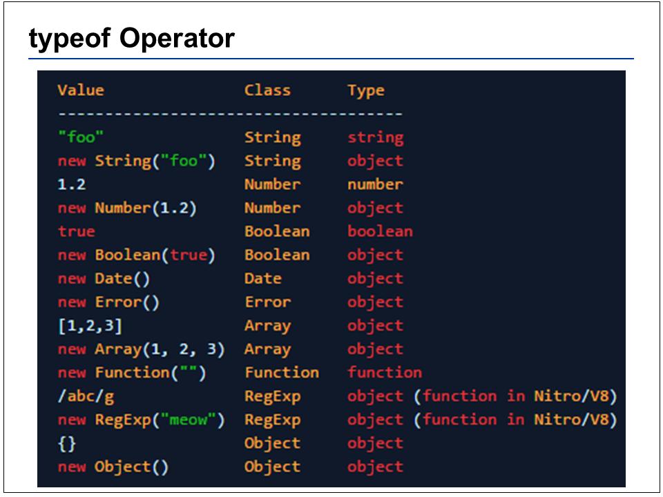

# Types, Quirks and Common Misconceptions

JavaScript is a beautiful, quirky and typically misunderstood language, yet it dominates the web browser
 
 
 

Primitive means once the value is created, it cannot be modified. As we dive deeper, I will explain why JavaScript does not have a function or array type
 
 
 

JavaScript has a typeof operator… which has very questionable value… it may even create more confusion that value
 
 
 

This is a bug, but it cannot be changed because so much code relies on this expression evaluating to object
 
 
 

The difference is subtle and debated, but null can be used to represent a variable who was explicitly given the value of “null” and undefined can be used to indicate variables that have been declared but not assigned an explicit value
 
 
 

JavaScript has this idea of things being truthy or falsy. Something is said to be truthy if it is not one of the stated “falsy” values
 
 
 

Different programming languages create scope in different ways. Languages like C use block scope, where every curly brace creates a new scope. By default there is a global scope, but there are not functions in this code, so there is only 1 scope in JavaScript. As of ES5, JavaScript only has function scope
 
 
 

**live code examples

Some people will debate the true name, so just focus on the higher-level purpose, not the syntax. You may be wondering, why is there a String Constructor, I thought strings were primitives...?
 
 
 

Whenever you try to refer to a property of a string, JavaScript converts the string value to an object. Once the property has been resolved with the new value, the object is discarded and you are left with a new primitive value
 
 
 

When someone asks “what is the difference between == and ===?” The correct answer is, == applies type coercion, === does not. Type coercion rules in JavaScript can be complex and counterintuitive, so beware
 
 
 

So what is really going on here?? When you execute the function on line 9, a copy of the reference to myArray is created and becomes a local variable “arr”. Only line 4, you access a key inside the “arr” reference and modify it, which in turns modifies myArray since it references the same place in memory. On line 5, you take the local variable “arr” (that is a copy of the reference to myArray), and you tell that variable to point to a different array, a different place in memory. Changing the reference contained in “arr” does not affect the reference stored to the global variable of “myArray” and therefore line 5 basically does nothing.
 
 
 

