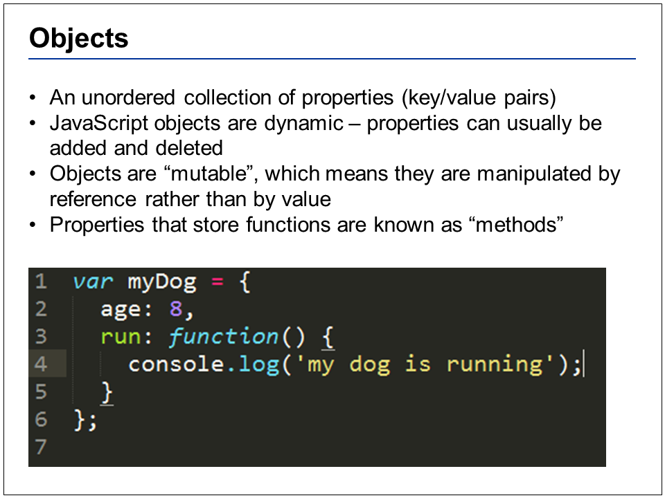
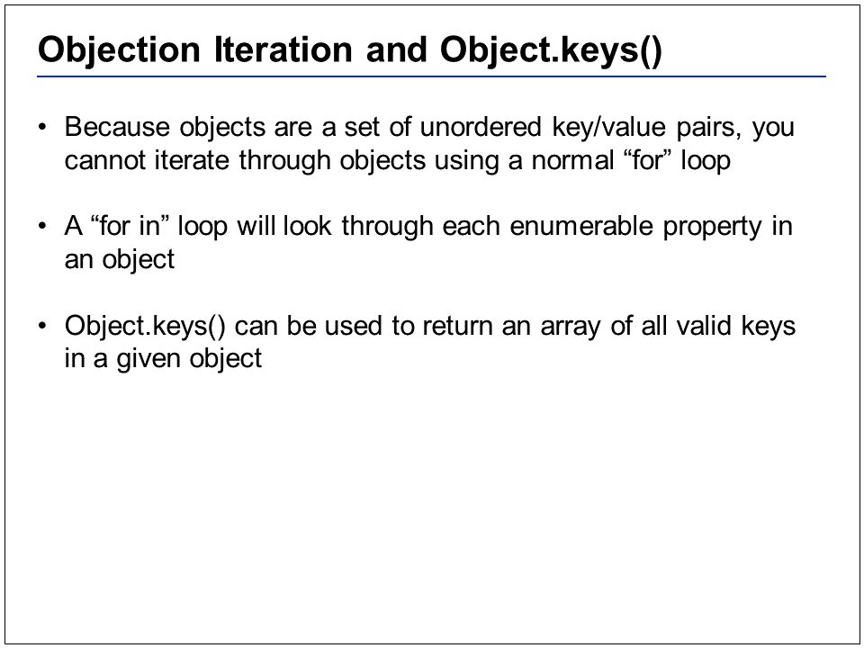
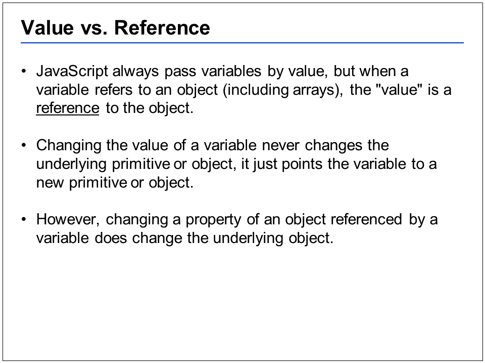

# Objects and Arrays

Any value that is not a string, number, false, true, null or undefined is an object
 
 
 

There are 3 distinct ways to create a new object
 
 
 

In this example, there are 2 distinct number 42’s. There is only 1 object, with 2 variables that point to the same place in memory
 
 
 

One reason why OOP is so valuable is the concept of inheritance. This is powerful because it provides code reuse, and makes your code more modular as you can associate properties/methods with certain objects, like “animal” or “dog”, and objects lower on the chain can simply inherit those properties, so we don’t have to explicitly define all of the properties on of these object.
 
 
 

