# Functions and Scoping

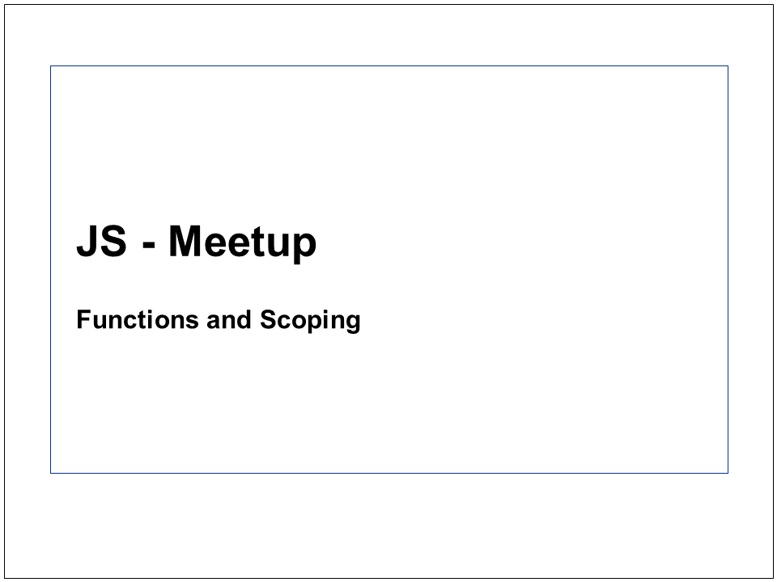
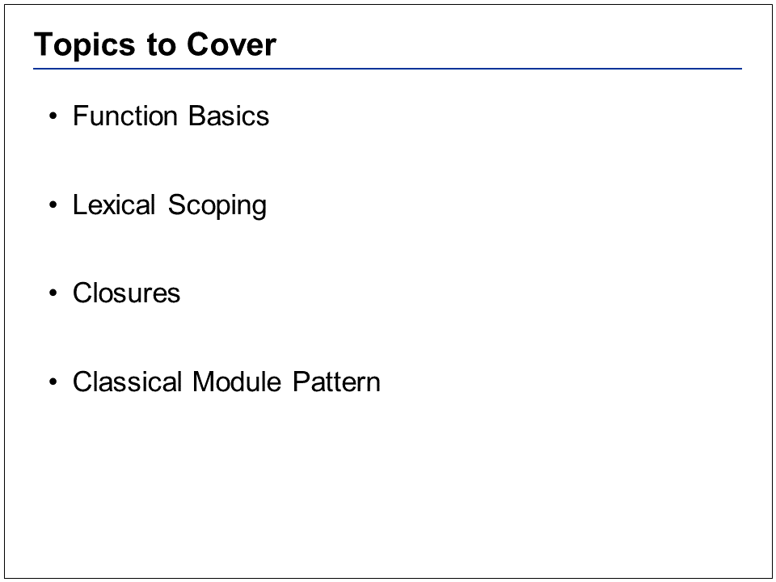
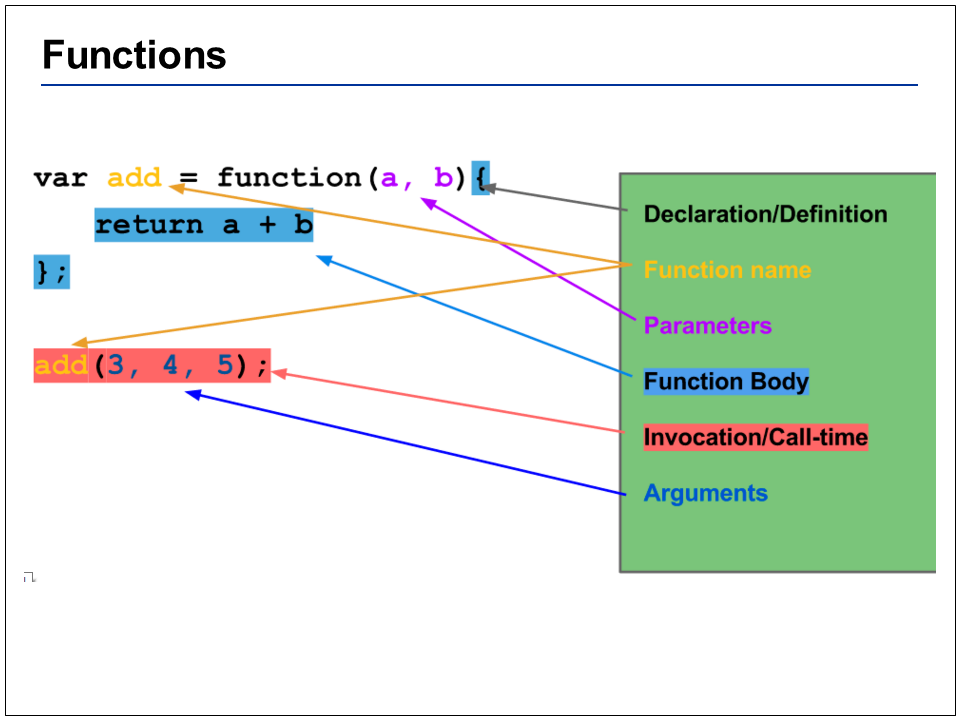
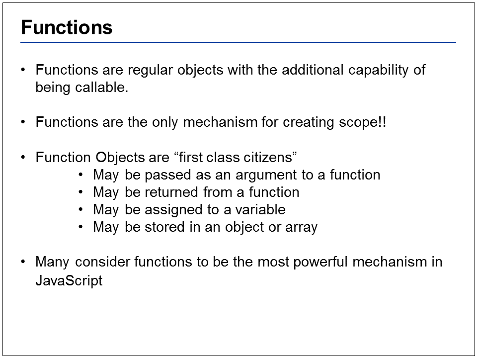
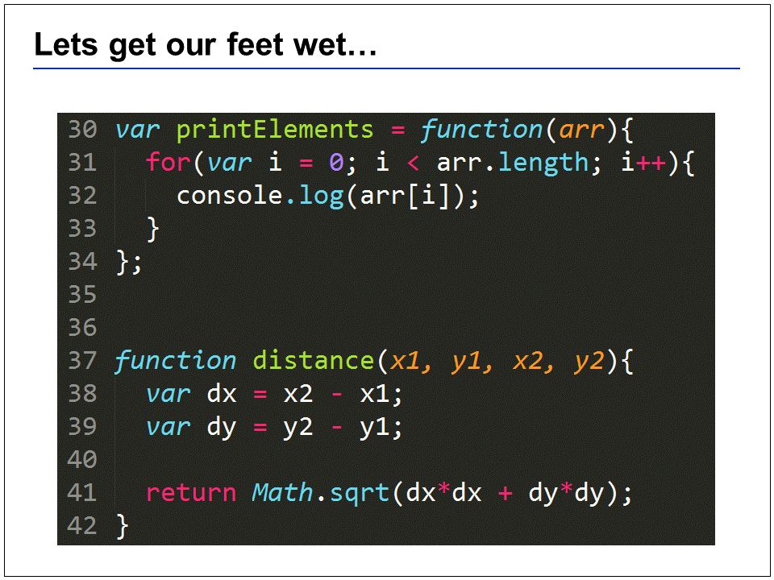
What does printElements return? (undefined)
Look at the differences between the way I’ve defined the “printElements” and “distance” functions
 
 
 
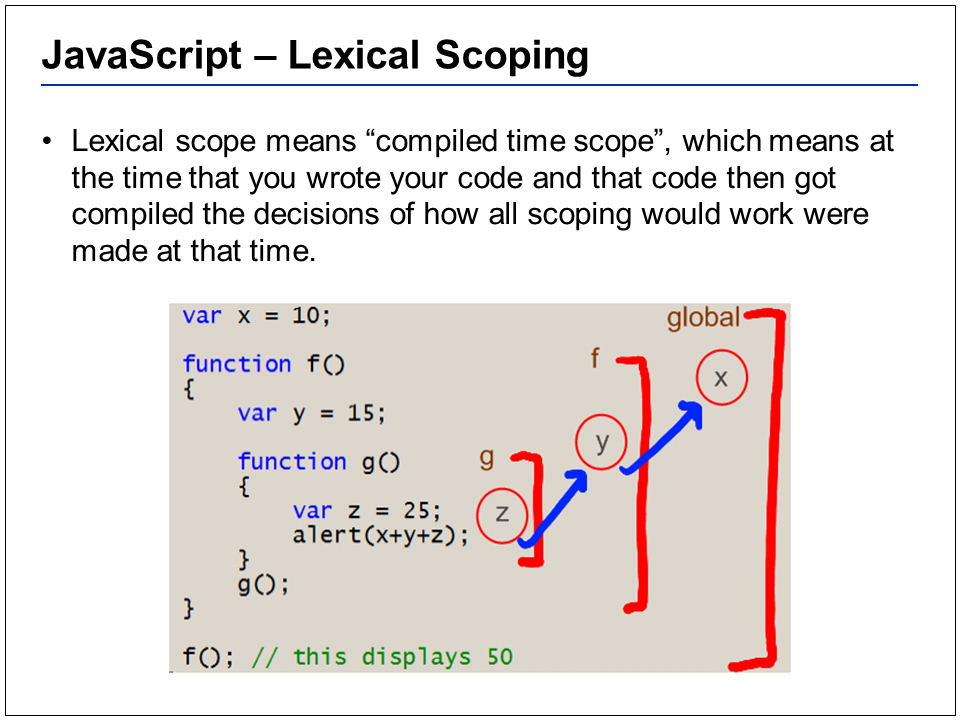
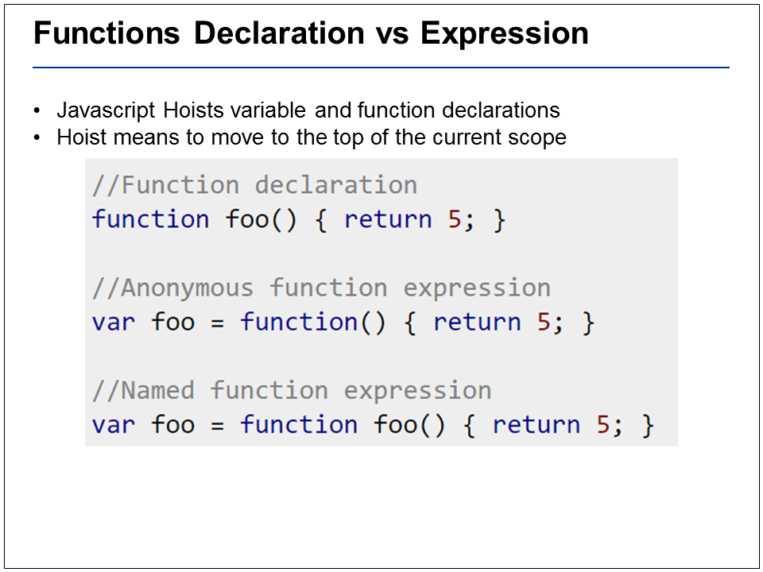
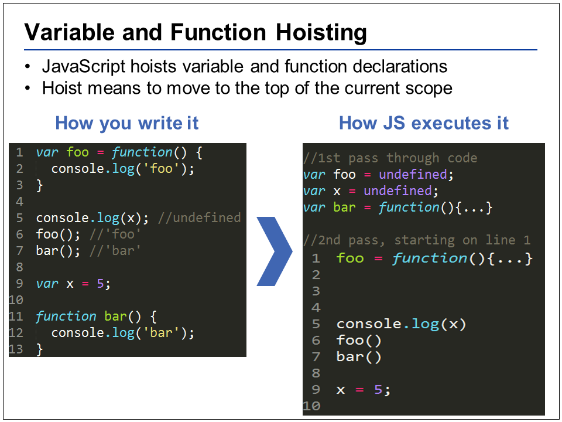
JavaScript makes 2 passes at your code, first moving variable/function declarations to the top of a scope. The 2nd image on the right is a “pseudo” example of how the code you write is not exactly how it is executed
 
 
 
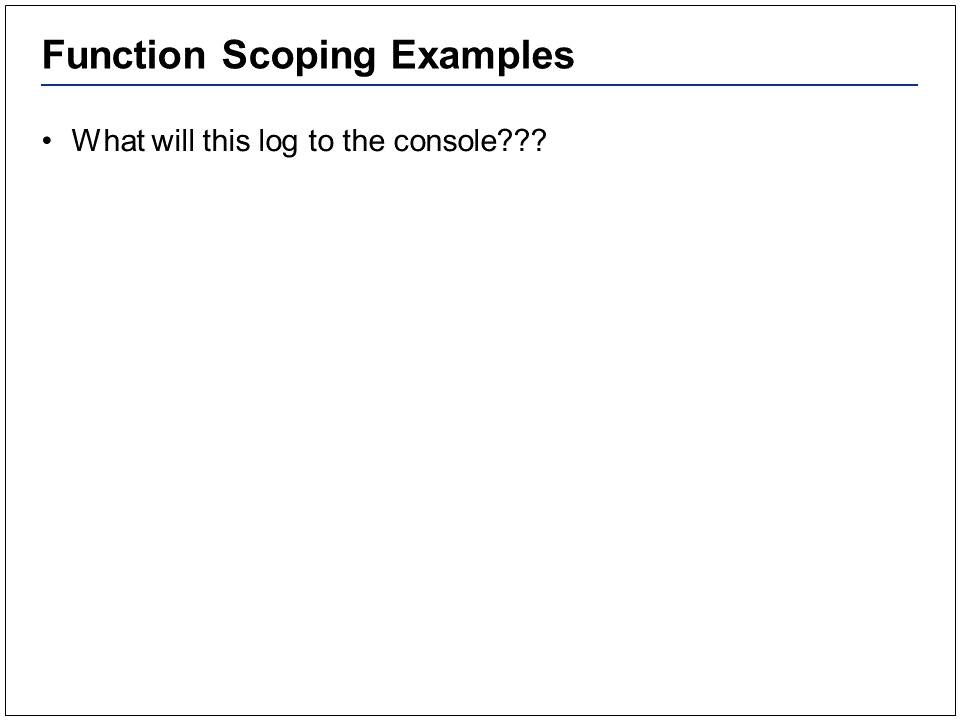
See “func_examples.js” and show these snippets in a REPL
Solutions in “func_answers.js”
 
 
 
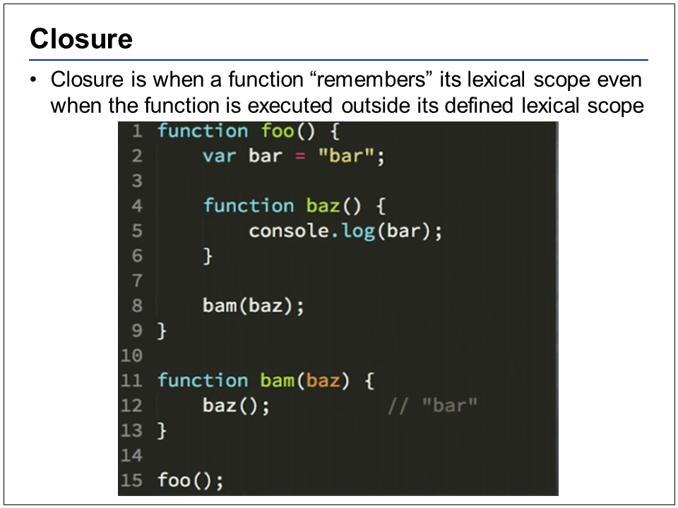
Here we have an outer function called foo. On line 2, we create a local variable called “bar” within the foo function. On line 4 we declare an inner function baz. We know that baz can reference bar. On line 8, we take a reference to the function baz and pass it outside of the function foo to the “bam” function. On line 12 when I execute that baz function, baz is still able to access the lexical scope in which it was defined even though baz is executing outside of that lexical scope. This all comes back to the fact that JS has first class functions, functions that can be passed around and they can be executing in entirely different environments.
 
 
 
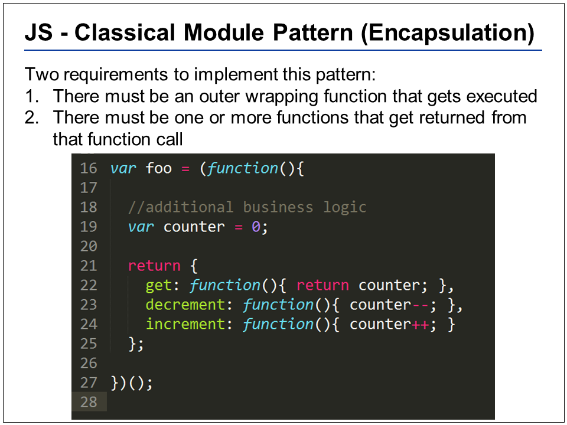
We can utilize closures to create a defined API that the user can interact with, public methods that allow the user to “get”, “increment” or “decrement” the counter. Notice how this module is working, we are creating an encapsulating function on line 16 and immediately invoking it (IIFE). When this file loads, there is no way to access the counter variable, its private to this foo object that is returned on line 21. But, we can call “foo.get” to see what our counter is at any point in time, or we can call “foo.increment” to increase the counter by 1.
 
 
Again, realize that the user of the game cannot modify the counter variable, because it is private due to closure, it can only be interacted with in a specific way. Also, if you had any additional business logic, or variables you wanted to add, you could do so also without the user getting direct access. What this allows us to do is to hide private implementation details and only expose the least amount of information necessary for the user to interact with.
 
 
 
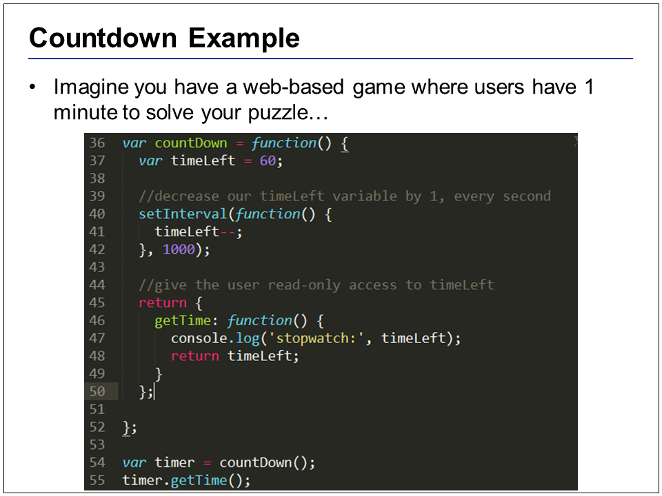
Notice we create a closure around a variable called “timeLeft” (line 37) and return a function that allows us to only see the time left (46).
 
 
 
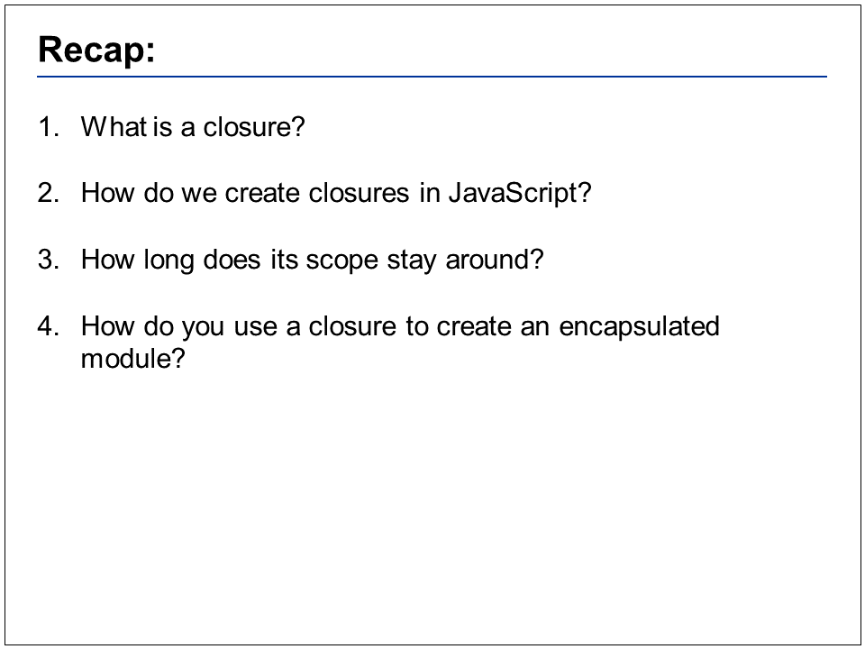
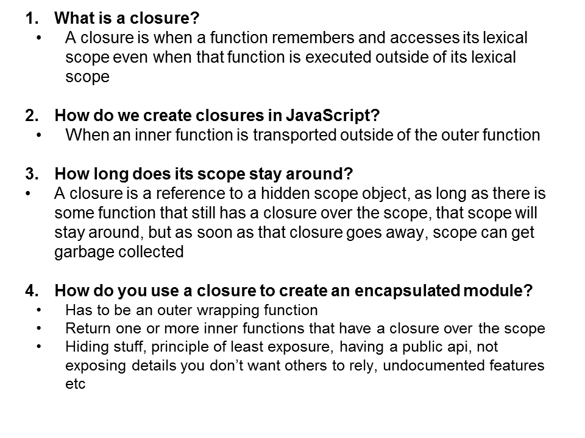
