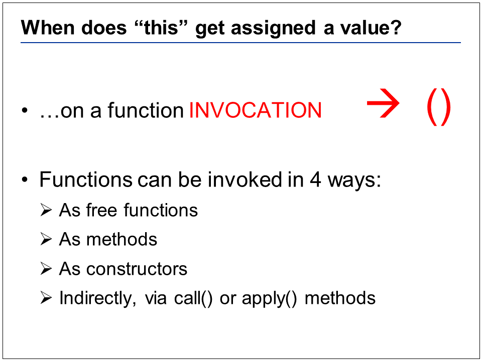
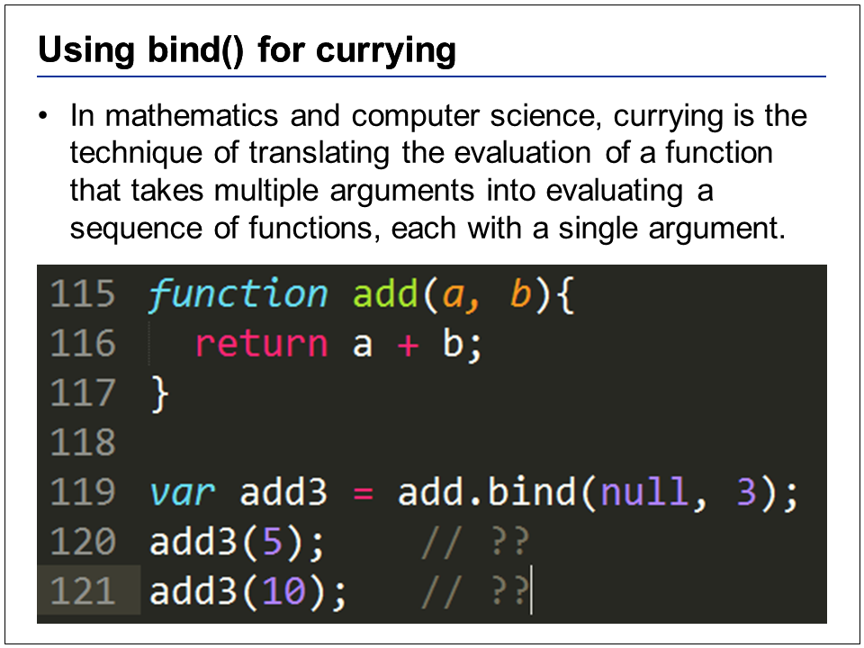

# Keyword this

If you refer to “this” outside of any function, “this” will reference the global object “window”
The primary reason why global variables are discouraged in JavaScript is because, in JavaScript all code share a single global namespace, also JavaScript has implied global variables ie. variables which are not explicitly declared in local scope are automatically added to global namespace. Relying too much on global variables can result in collisions between various scripts on the same page.
 
 
 

There are some additional things going on when you use the “new” keyword, that involve the newly created object’s prototype, but we will not be covering that concept here
 
 
 

Call and Apply do the same thing, forcing the “this” context… but the extra arguments you pass in are different. ".apply" takes an array as its 2nd argument. ".call" takes a comma separated list of arguments for the 2nd argument and later
 
 
 

In this example, we have two separate functions that exist on methods on different objects
 
 
 
//2 
//2 
//1 
//1

In this example, we have only 1 function, which may appear to look like a free function, but is later attached by variable reference to two different objects
//Line 90: 2 
//Line 91: 3 
//3 
//2 
//3 
//2
The key takeaway is that we only need to care about the 1st parameter to define what our “this” context will be
 
 
 

Bind is similar to call, except that it does not invoke the function and instead returns a new function that binds the “this” context, and potentially the functions arguments
 
 
 

We never actually execute “add” until line 120, but we are basically forcing “a” to be 3. Its sortof like saying the following   “ add3 = function(b){return 3 + b}; “
 
 
 

//6 
//37

When we assign “this” to another variable, we are keeping it from being shadowed by the inner function. By default, all functions get their own “this” keyword, and when a reference is found in a local scope javascript will not continue looking outside of that function, so we need to save the “this” reference to some arbitrary variable name that will not exist in the inner function “x”, keeping it from being “shadowed”
 
 
 

The timer API gives is the ability to execute functions asynchronously, but when we do so we lose context to the call time reference to the left of the dot “.”
 
 
 

Here is an example of how we can take advantage of call/apply to return functions that perform modified actions. We can pass in a function to “once” and it will return to us a new function that can only be executed once. It does this be retaining access to a variable in a closure, called “hasBeenCalled”. This Boolean flag will be checked on every execution to see if it is false, and after executing the function for the first time it will change this Boolean flag to true, basically short-circuiting this function from ever being called again. Line 174 will kick off the “processCreditCard” function, subsequent calls on lines 175-177 will essentially do nothing
 
 
 

