# Asynchronous Programing - Callbacks and Promises

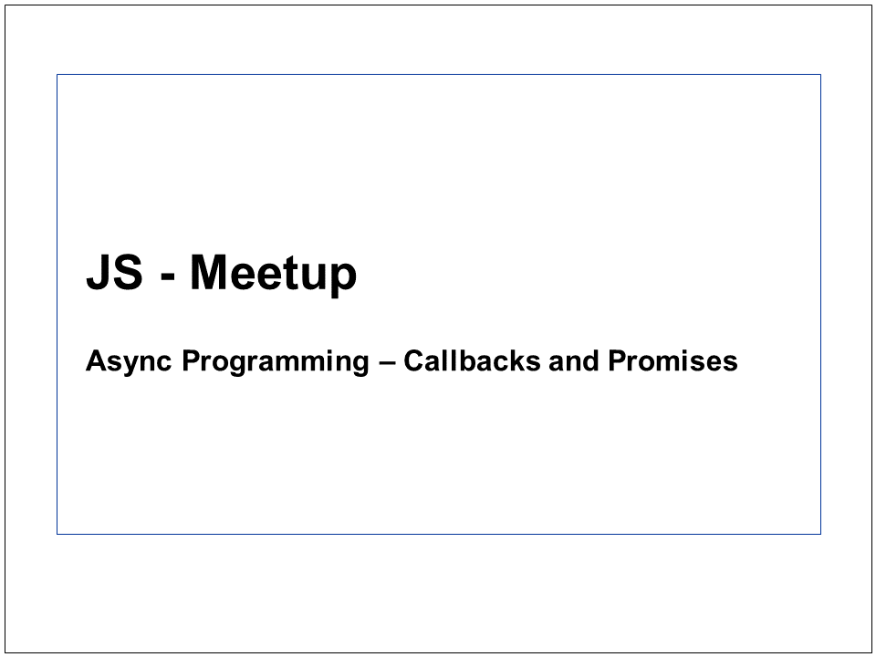
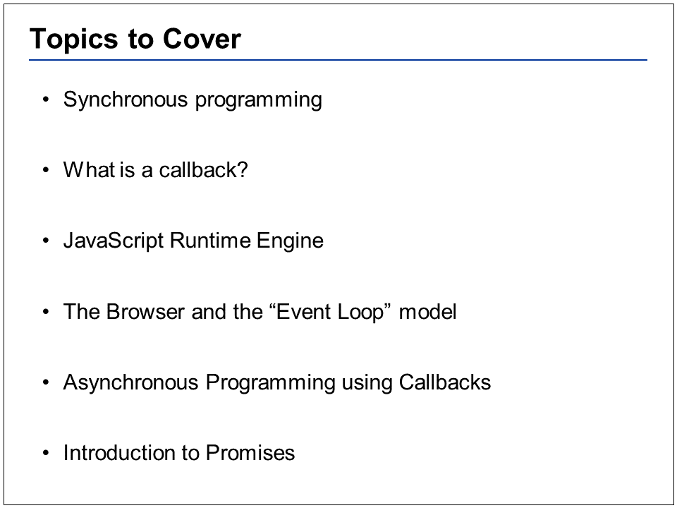
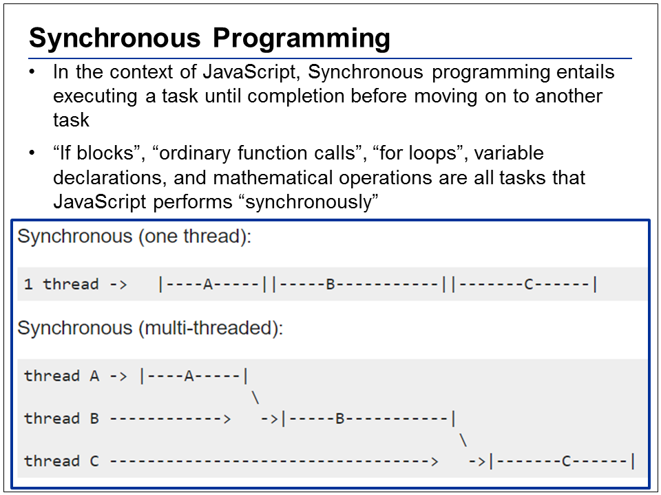
See example #1
 
 
 
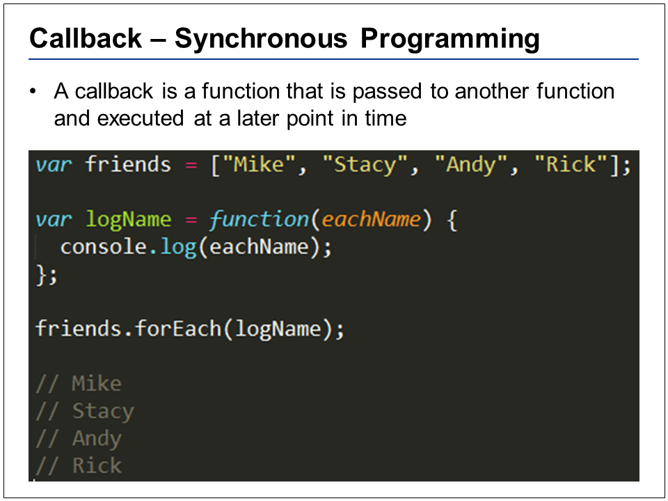
Because functions are first-class objects, we can pass a function as an argument in another function and later execute that passed-in function or even return it to be executed later.
 
See example #2
 
 
 
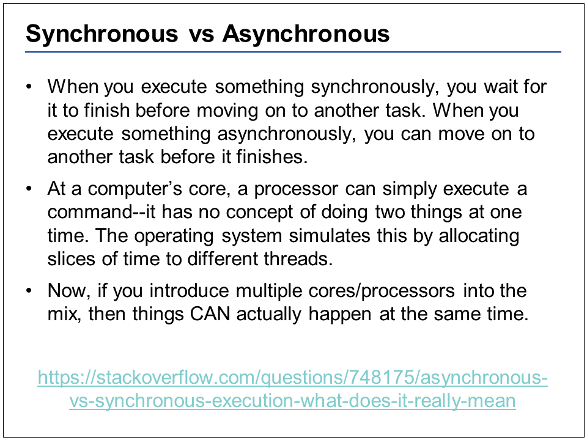
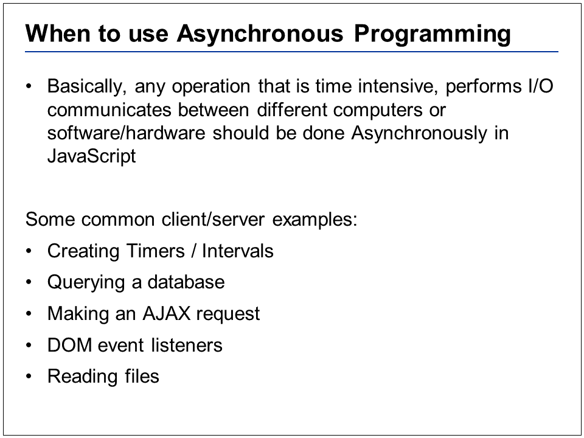
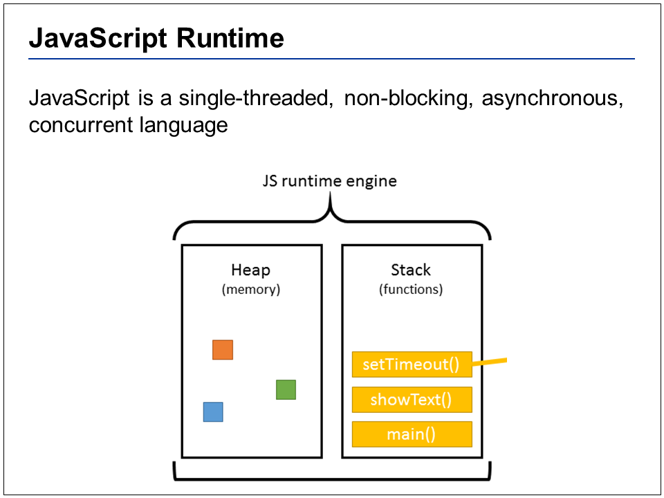
This diagram is a simplified view of the JS runtime. The head is where memory allocation happens, but we won’t be spending much time talking about this part. JavaScript is a single threaded program language, which means it has one call stack, which means it can do one thing at a time. That is what a single thread means (it can only do one thing at a time). Your first thought may be to assume JavaScript is extremely inefficient, since it can only do one thing at a time.
 
 
 
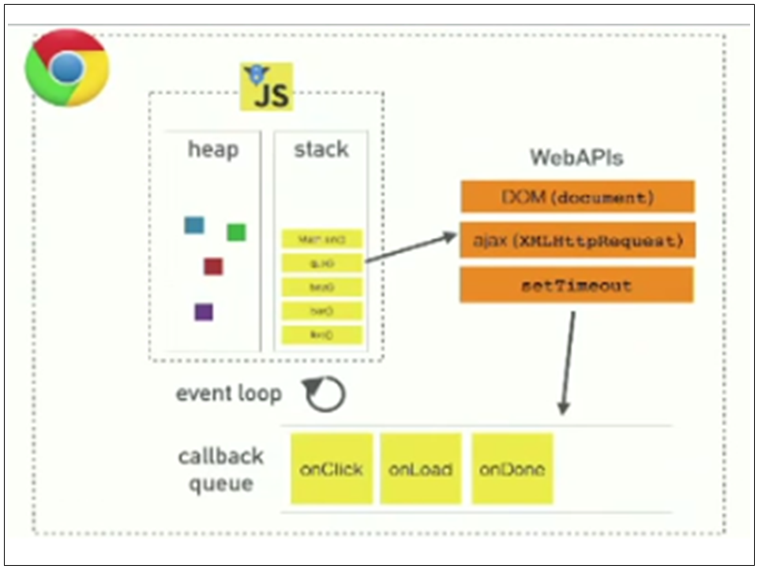
When users interact with their browser, they are interacting with several web APIs as well as the JavaScript runtime environment. By accessing these web APIs, we allow the API’s to go off and do their own work in separate threads, while the JavaScript runtime continues through its call stack. All of a sudden, it’s like we can do multiple things at once. And mastering asynchronous programming in JavaScript requires you to understand how the “Event Loop” works. JavaScript has a concurrency model based on an "event loop". This model is quite different than the model in other languages like C or Java.
 
Event Loop Priority: 
1. execute whatever is in the call stack  
2. if the stack is empty, process any callback’s in our queue  
 
Look at examples #3 and #4 – realize the difference between synchronous and asynchronous timers
 
 
 
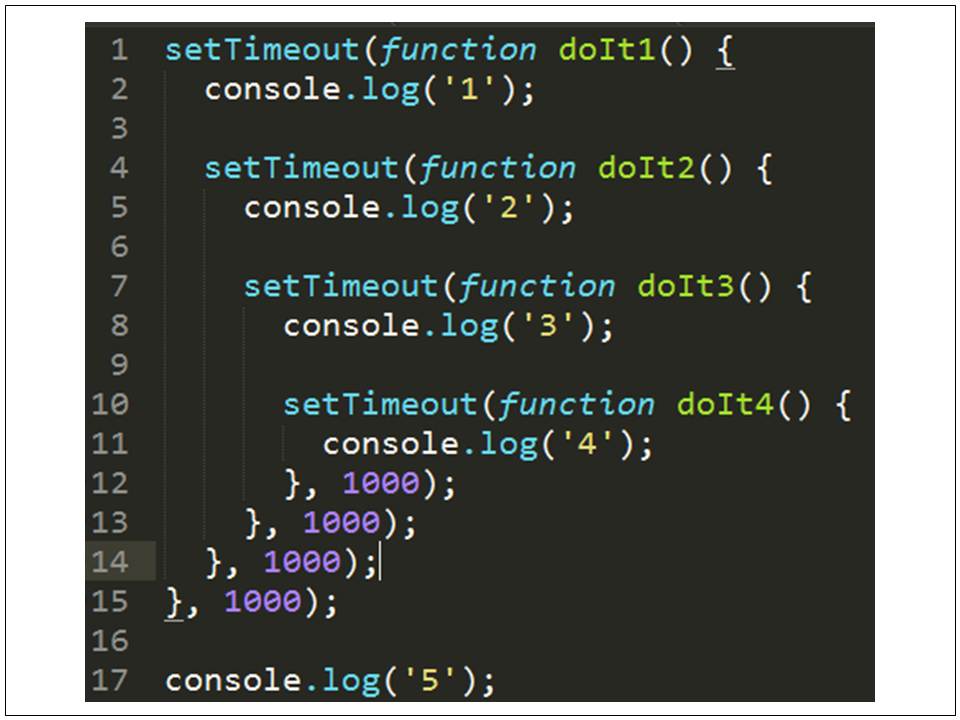
**What will this do? See problem #5
 
 
 
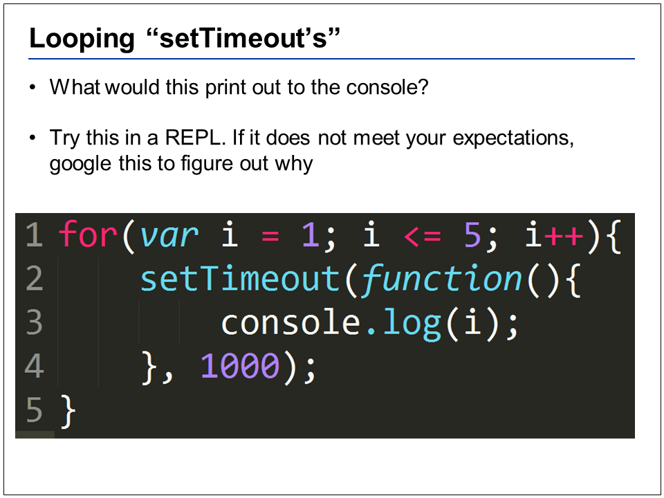
I am looping from i=1 to i<=5, and create a setTimeout that is going to execute the inner function 1 second (1000 ms) in the future. What is your expectation of what this should print out?
 
Answer:  you actually get 6, printed out 5 different times
 
 
 
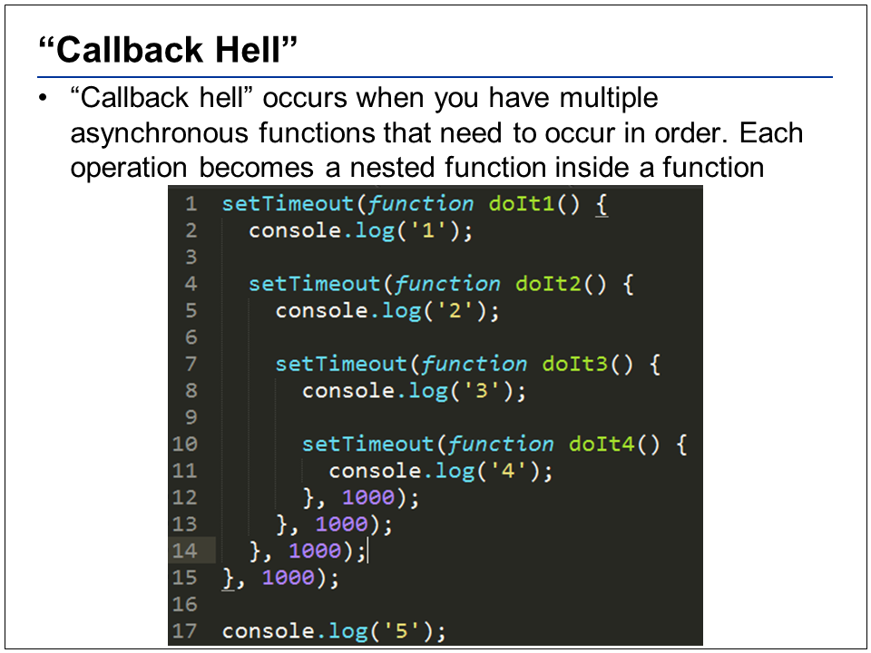
Callback hell is a well-known phrase in the JavaScript community, since we live in a single-threaded, concurrent language. Callback hell occurs when you have multiple asynchronous functions that need to occur in order. Each operation becomes a nested function inside a function, which becomes pain in refactoring and maintaining. It can also make the simplest of code seem complicated. Even just looking at this statement, you have to read through like 4 indentations and 9 lines to figure out what the heck is going on here.
 
 
 
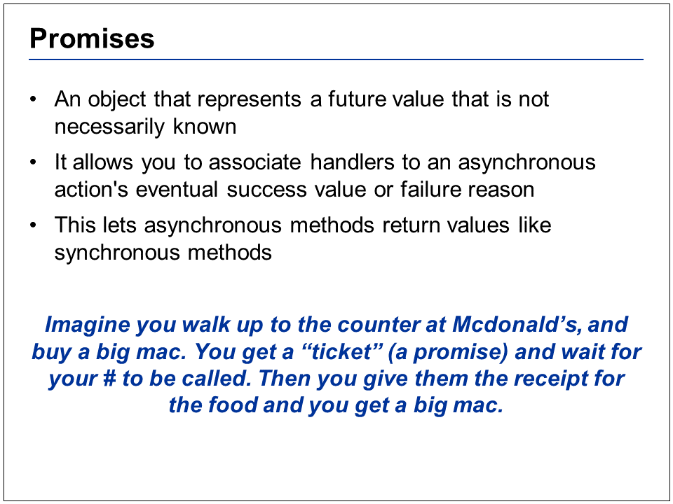
Promises allow us to avoid callback hell and reason about our code “as if” it were synchronous
 
 
 
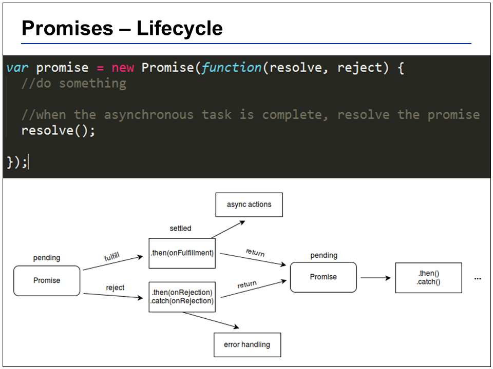
Here’s how you create a native promise (new ES6 standard)
 
**See coding example #6
 
 
 

