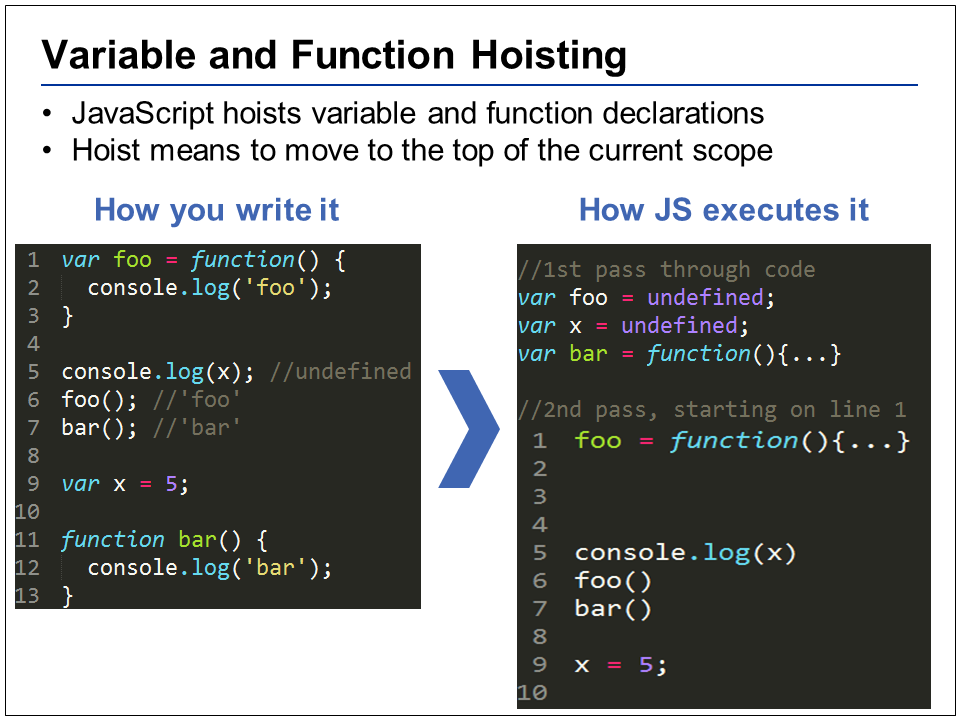

# ECMAScript 6 (ES 2015)
This presentation is highly interactive, and involves a lot of coding snippets taken from from a book series called "You Dont Know JS" by Kyle Simpson (AKA getify). Kyle Simpson is MakerSquare's head of curriculum and evangelist of the open web / JavaScript.
 
https://github.com/getify/You-Dont-Know-JS
 
 
 

There are many ES6 changes we won’t be covering. But I feel these are some of the more important things to talk about that a beginner developer would be able to bite off (promises are covered in a different lesson). First we will give a brief recap of scoping rules in JavaScript (ES5) in order to compare / contrast the changes coming to ES6.
 
 
 

Switch to coding examples until you hit the section on generators. The files are ordered “01_scoping.js” to “07_generators.js”.
 
 
 

Generators give us a very powerful way to deal with asynchronicity (and even concurrency), and many experts hypothesize that combining the use of promises and generators could be the single most powerful pattern to emerge from the ES6/ES2015 spec. This can get really advanced and out of the scope of these lessons, but to learn more about generators, I would recommend these multi-part blog posts on generators:
 
["David Walsh's Blog"](https://davidwalsh.name/async-generators)
["Kyle Simpson's Blog series on promises"](http://blog.getify.com/promises-part-1/)
["Comparing ES6 generators to GO style concurrency"](https://swannodette.github.io/2013/08/24/es6-generators-and-csp/)
 
 
 

