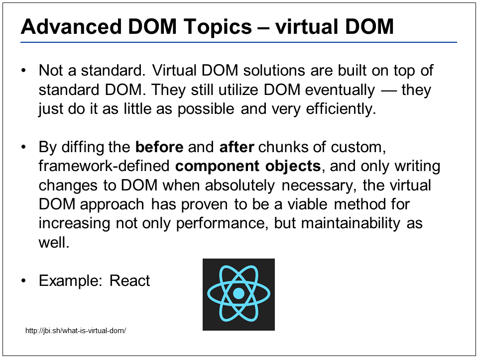

# JavaScript and the Document Object Model

We are going to be working with a VERY BASIC webpage, but focus on the higher-level concepts being explained. Libraries like jQuery provide a large abstraction, and seemingly making our lives easier for DOM manipulation, but if you don’t understand the DOM interactions at the core JavaScript level, you will always live in IGNORANCE and jQuery bliss!!
 
 
 

Solution code can be found at “app_solution.js”. “index.html” by default has the script tag set to include app.js, so if you’d like to view “app_solution.js”, you will need to modify the "script" src attribute.
 
 
 

Feel free to modify the commented code in “app_solution.js”, tinker around with setting the event listeners in different phases (capture vs bubble) and use stopPropagation in certain handlers to see what happens on a click on either the window or the "p" I took a couple of photos ..."/p" tag
 
 
 

